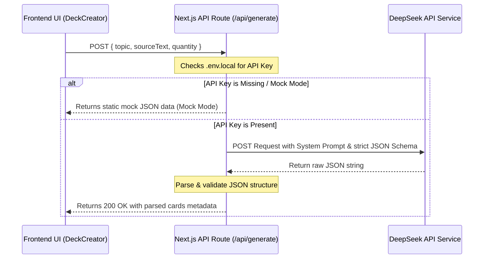

# Technical Documentation - Excelerate Flashcard Engine

Excelerate Flashcard Engine ek modern, AI-powered interactive web application hai jo users ko dynamic flashcards generate karne aur study sessions track karne mein help karta hai. Yeh application custom concepts seekhne aur active recall + spaced repetition principles ko practice karne ke liye optimize kiya gaya hai.

---

## 🚀 Features (मुख्य विशेषताएँ)

Excelerate Flashcard Engine mein kaafi powerful aur interactive features shamil hain:

### 1. AI-Powered Flashcard Generation (DeepSeek AI Engine)
* **Smart Generation**: Users kisi bhi topic (jaise *Photosynthesis*, *React Hooks*) ya phir apne personal study notes/material ko textarea mein paste karke automatic flashcards generate kar sakte hain.
* **DeepSeek Integration**: API request `/api/generate` route ke through DeepSeek Client API (`deepseek-chat` model) ko hit karti hai aur precise, high-quality, concept-based Q&A format mein JSON output leti hai.
* **Mock Fallback**: Agar `.env.local` mein `DEEPSEEK_API_KEY` configured nahi hai, toh app user experience ko break kiye bina intelligent Mock Data return karti hai taaki log core flow ko test kar sakein.

### 2. Manual Deck Creator (मैन्युअल डेक निर्माण)
* Users manually apna custom Deck Name aur Description dekar cards create kar sakte hain.
* Dynamic card rows (+ Add Another Card) ko use karke multiple cards add/delete karne ki flexible UI hai.

### 3. Interactive Study Session & 3D Card Play (इंटरएक्टिव स्टडी सेशन)
* **3D Flip Effect**: Flashcards custom CSS 3D transforms (`perspective-1000`, `transform-style-3d`, `backface-hidden`, aur `rotate-y-180`) ka use karke smooth 3D flipping animation offer karte hain.
* **Self-Grading System**: Card flip hone ke baad users self-grade kar sakte hain:
  - **Correct (Green)**
  - **Incorrect (Red)**
* **Progress Tracking**: Real-time progress bar session ke current state ko dynamic transition ke sath calculate aur display karti hai.
* **Keyboard Accessibility**: Fast learning workflows ke liye keyboard keys add ki gayi hain:
  - `Space`: Card flip/unflip karne ke liye.
  - `ArrowLeft` / `A`: Card ko *Incorrect* mark karne ke liye.
  - `ArrowRight` / `D`: Card ko *Correct* mark karne ke liye.

### 4. Advanced Dashboard & Analytics (डैशबोर्ड और स्टेट्स)
* Dashboard par live updates dikhte hain:
  - **Total Decks**: Total kitne flashcard sets hain.
  - **Total Cards**: Saare decks ko milakar kitne total cards hain.
  - **Sessions Completed**: Ab tak kitni study sessions poori ki gayi hain.
  - **Overall Accuracy**: Total success rate (%) jo session-by-session update hota hai.

### 5. Multi-Theme Customization (मल्टी-थीम सपोर्ट)
App mein three primary visual modes hain jise root element variable configuration se switch kiya jata hai:
* **Dark Theme (🌙 Default)**: Low-light environment ke liye sleek dark glassmorphism design.
* **Bright Theme (☀️ Light Mode)**: Clean blue accent ke sath premium bright view.
* **Ultra-Bright Theme (⚡ High Contrast)**: Black-and-white high contrast look aur violet accents ke sath responsive layout.

### 6. Local Storage Persistence (डेटा स्टोरेज)
* Bina kisi database overhead ke, saare generated/custom decks aur study stats local browser cache mein `localStorage` API ka use karke persist hote hain. Page refresh karne par bhi data lose nahi hota.

---

## 🛠️ Technology Stack (उपयोग की गई तकनीकें)

Application ko state-of-the-art modern frontend stack se build kiya gaya hai:

| Technology / Library | Version | Purpose / Description |
| :--- | :--- | :--- |
| **Next.js** (App Router) | `16.2.9` | Production-ready React framework jo serverless routes (`/api/generate`) aur optimized clientside rendering handle karta hai. |
| **React** | `19.2.4` | Component architecture, state hooks (`useState`, `useEffect`), aur event handling ke liye core library. |
| **Tailwind CSS** | `4.3.1` | Utility-first styling framework jo CSS variables aur customized colors ke sath fully responsive aur gorgeous dark/light UI themes facilitate karta hai. |
| **TypeScript** | `5.x` | Clean, type-safe development environment, strict types interfaces (`src/types.ts`) define karne ke liye. |
| **DeepSeek API** | `v1` | LLM API client jo concept-based educational definitions aur flashcard structure generate karta hai. |
| **HTML5 Web APIs** | Native | `localStorage` API cache storage aur Native Keyboard Event API listeners. |

---

## 📁 Project Structure (प्रोजेक्ट फ़ाइल संरचना)

```bash
excelerate-flashcard-engine/
├── src/
│   ├── app/
│   │   ├── api/
│   │   │   └── generate/
│   │   │       └── route.ts       # DeepSeek API integration route & Mock handler
│   │   ├── layout.tsx             # Root layout wrapping global styles
│   │   ├── page.tsx               # Main Dashboard UI & theme state orchestrator
│   │   └── globals.css            # Custom Tailwind themes & 3D CSS utilities
│   ├── components/
│   │   ├── DeckCard.tsx           # Individual Deck presentation & delete confirmation
│   │   ├── DeckCreator.tsx        # Toggle tabs for AI generation & manual deck entry
│   │   └── FlashcardPlay.tsx      # Core study environment (3D flip, stats, shortcuts)
│   ├── types.ts                   # Flashcard, Deck, and Session type definitions
├── .env.local                     # DeepSeek API keys (local-only configuration)
├── tsconfig.json                  # TypeScript compiler settings
├── tailwind.config.js / postcss   # PostCSS style configuration
└── package.json                   # Dependency definitions and scripts
```

---

## 🚦 How it Works (यह कैसे काम करता है - API Flow)



---

## 📝 Setup Guide (स्थापना निर्देश)

1. **Clone repository & Install dependencies:**
   ```bash
   npm install
   ```

2. **Configure API Key:**
   Root folder mein `.env.local` create karke apni DeepSeek key configure karein:
   ```env
   DEEPSEEK_API_KEY=your_actual_deepseek_api_key_here
   ```

3. **Run in development mode:**
   ```bash
   npm run dev
   ```
   Open `http://localhost:3000` to preview in browser.
